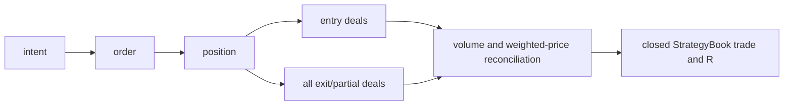
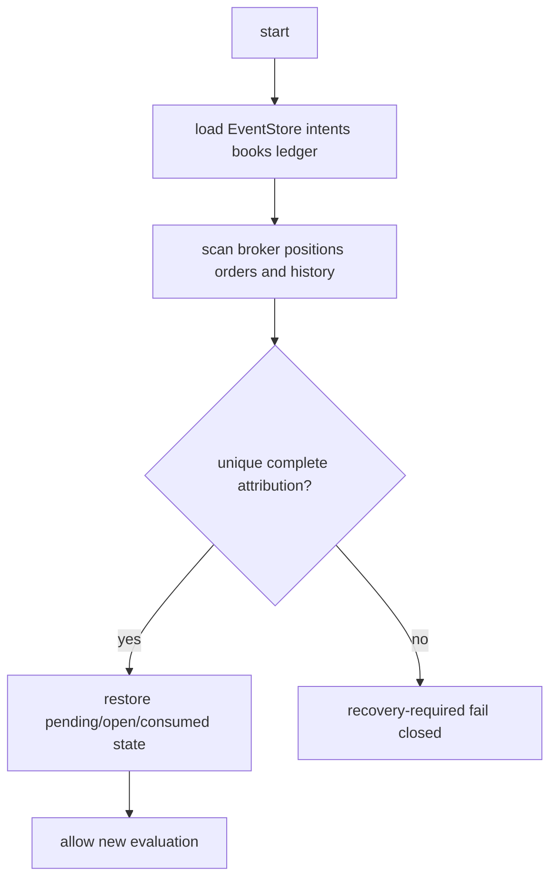

# Six-Family Architecture Map

Audit base: `d742a9e45b2404b19ca2496212aa6f52c9101053`.

## Input and structure

`Experts/MultiSpeedZigZagEA.mq5::ProcessClosedBar()` calls `CopyRates(...,0,max(300,InpHistoryBars))`, sets chronological array order, and uses the last completed bar (`copied-2`) by rebuilding with the prefix ending there. `CMSZZTripleZigZagEngine::Rebuild()` calls `BuildSpeed()` for fast, medium, and slow. Each speed scans the full prefix, confirms pivots only after ATR reversal and minimum spacing, then computes current projections and a last-bar close-cross break.

| Field | Producer | Meaning/ownership | Mutation/staleness |
|---|---|---|---|
| `MSZZPivot.*` | `ConfirmHigh/ConfirmLow` | Immutable pivot price, pivot/confirm time, label and ID | Replaced in last/prior slots on later confirmation |
| `atr`, `reversal_threshold` | `BuildSpeed` | Last represented closed bar | Recomputed every rebuild |
| `leg_direction`, `current_extreme*` | `BuildSpeed` | Current unfinished leg | Snapshot state, not event-owned |
| `last_*`, `prior_*` | pivot scan | Latest two confirmed pivots of kind | Can change after setup arms |
| `resistance_now`, `support_now` | `ProjectLine` | Projection of latest two same-kind pivots at current bar | Changes with time and pivot replacement |
| break flags | `BuildSpeed` | Previous close/current close crossing prior/current projection | True only for represented last bar |
| break event IDs | `BuildSpeed` | symbol/TF/speed/direction/time plus last pivot ID | Identifies crossing and one pivot, not a frozen level |
| regime amplitude | `RegimeClassifier::SwingAmplitudeR` | absolute current last-high/last-low difference / current ATR | Not owned by the current break event |
| session | `MSZZResearchSessionId` | broker-hour bucket `<8`, `<16`, else | Not DST-aware; not the requested frozen session model |

Answers: a bullish event ID does **not** prove identity with a later `resistance_now`; it only embeds the last-high pivot used during that rebuild. `fast_swing_amplitude_r` is not event-owned. Pivots are updated during the full scan before final-bar projections/break flags are calculated. Any armed setup holding a snapshot-derived value can diverge from later snapshots; only explicit copies remain stable.

## Research path


`CMSZZSixFamilyResearchSuite::Evaluate()` calls SSR, MC, BRC, CBR, TP, RR in that order. They have separate private state and share only read-only snapshots/regime/bar values. `CMSZZResearchCandidateFactory` validates geometry and constructs the research type. Journal schema has 23 columns but lacks a separate `sequence_id`; historical `structural_context` contained delimiter-bearing compound data.

## D032 simulator

`Tools/D032/simulate_and_screen.py` parses candidate/rates/regime CSVs, maps signal time to the next bar, applies spread to executable entry, rejects a signal whenever that family has an open trade, and exits at stop/target or test end. It has no opposite-signal close/reversal. The source documents its legacy malformed-row reconstruction; that behavior is forbidden prospectively. It computes R, MFE/MAE, holding time, development/validation/holdout, exclusions, session/regime attribution, and P4 overlap.


## Production paths


Standalone calls one selected cluster through `ExecuteCluster`; portfolio mode filters by strategy and calls `ExecutePortfolioBookCandidate`. `PortfolioBookRouting::ConsumedKey` namespaces persistent consumption. `PrepareMarketCandidate` uses current executable market price, broker stop constraints and target reconstruction. `PositionSizing`, `PortfolioRiskManager`, ownership and margin gates precede submission. `ExecutionIntentStore` persists lifecycle identity; `StrategyBook` owns pending/open/flat transitions; `ExecutionCoordinator` submits; `OnTradeTransaction`, history scans, `PortfolioJournals`, and reconciliation map deals back to book/intent.

Standalone book:

```text
all production candidates -> one global cluster selection
-> raw cluster EventStore check -> active standalone StrategyBook
-> common preparation/risk/intent/order -> owned position
```

Multi-book portfolio:

```text
candidates -> filter per supported strategy -> per-strategy clusters
-> strategy-qualified consumed key -> routed StrategyBook
-> portfolio coexistence/risk policy -> common intent/order path
```

## Stage contracts and evidence

| Stage | Input → output | Reject/state | Evidence/tests |
|---|---|---|---|
| handoff | raw → eligible candidates | invalid ID/geometry/expiry/allowlist | signal journal; CandidateHandoff tests |
| cluster | candidates → clusters/best | duplicate/coherence | cluster journal; Clusters tests |
| persistence | cluster → consumed key | already consumed/corrupt | EventStore file; routing tests |
| book | owner → pending/open/flat | wrong strategy/open/pending | book journal; StrategyBook tests |
| preparation | candidate → broker geometry | stops/spread/expiry | signal+sizing journals |
| risk | geometry → approved volume | sizing/margin/portfolio/ownership | risk journal and dedicated tests |
| intent/order | plan → order/position | persistence/order/recovery failure | intent store, transaction logs |
| exit | open book → close/modify | ownership/protection failure | exit/deal journals |
| reconcile | deals → weighted exit/R | unknown/duplicate/volume/R mismatch | trade journal; Reconciler tests |

## Identity transformation

```text
market structural origin -> origin_id
armed lifecycle -> sequence_id (missing as a dedicated research field)
final signal -> event_id
candidate origin/event -> cluster_id
strategy + cluster -> consumed_key
book + intent -> logical_position_id
order -> position ticket -> entry/exit deal tickets
```

These identities have different scopes. The SSR defect demonstrated why origin and sequence cannot be substituted.

## Reconciliation and restart



On restart, persistent events, intents, books and virtual allocations must reconcile with current broker positions/history before entry. Unknown records or failed protection set recovery-required state. `EventStore`, `ExecutionIntentStore`, `StrategyBook`, and `VirtualNettingLedger` provide persistence; restart and corruption coverage exists but six-family-specific restart parity remains a test gap.



## Principal architecture risks

The snapshot type lacks an immutable break-level record and common impulse owner. Research identity lacks a typed sequence field. Session classification lacks an authoritative timezone/DST service. Required family metadata is not typed. Production can express policies absent from the D032 simulator. These are blocking inputs to the v2 specifications, not permission to invent proxies.
